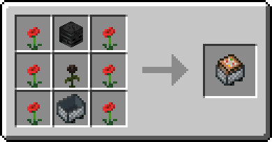

# Автоматизация I


**Ветка** [**древа знаний**](../knowledge-tree.md)**:** 1000 ✦ · нужна «[Перехват](intercept-1.md)» I **или** «[Химия II](chemistry-2.md)»


## Сборщик

> Обычный сборщик (автокрафтер) — только после изучения ветки.

| Свойство    | Значение                                                     |
| ----------- | ------------------------------------------------------------ |
| Без ветки   | Нельзя ни скрафтить, ни поставить, ни открыть                |
| Особенность | Крафтит что угодно — даже рецепты, которые вы ещё не изучили |
| Рецепт      | Обычный                                                      |

## Прогрузчик чанков I–III

> Держит чанки вокруг себя прогруженными — и ездит вместе с ними.

| Уровень | Радиус   | Одна визер-роза |
| ------- | -------- | --------------- |
| I       | 2 чанка  | 30 секунд       |
| II      | 4 чанка  | 20 секунд       |
| III     | 6 чанков | 10 секунд       |

**Как пользоваться:**

* Поставьте на рельсы (или выпустите из раздатчика).
* Топливо — визер-розы: ПКМ розой (с Шифтом — всей стопкой) или воронкой, направленной в блок с вагонеткой.
* ПКМ пустой рукой — сколько ещё проработает.
* Топлива влезает максимум на \~25 минут.
* После рестарта сервера работающие прогрузчики запускаются сами.


Сломанный прогрузчик выпадает целиком, но топливо в нём теряется.


**Рецепты:**



Маки или розовые кусты по бокам, сверху вниз по центру: череп скелета-иссушителя, визер-роза, вагонетка.




Прогрузчик I в центре, вокруг — 4 визер-розы и 4 плачущих обсидиана.

.png>)



Прогрузчик II в центре, сверху звезда Незера, вокруг — 3 визер-розы и 4 плачущих обсидиана.

.png>)



## Таймер

> Повторитель на 10, 30, 60 или 90 секунд.

| Свойство    | Значение                                                              |
| ----------- | --------------------------------------------------------------------- |
| Задержка    | 10 / 30 / 60 / 90 секунд — переключается ПКМ                          |
| Логика      | Как у повторителя                                                     |
| Над ним     | Надпись с текущей задержкой                                           |
| Особенности | Сломанный или взорванный выпадает собой; вода и поршни ему не страшны |

**Рецепт:** часы над повторителем, по бокам от него — 2 редстоуна.

.png>)
