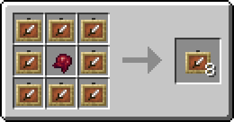
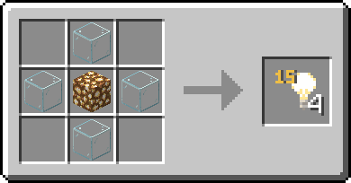

# Базовые рецепты


**Ветка** [**древа знаний**](../knowledge-tree.md)**:** 150 ✦ · без условий


## Маска Трагика

> Скрывает личность.

| Свойство                   | Значение                            |
| -------------------------- | ----------------------------------- |
| Как носить                 | На голове (поставить блоком нельзя) |
| При осмотре (ПКМ)          | Вместо вашего имени — «Неизвестный» |
| На отрубленной вами голове | Убийца — «Неизвестный»              |

**Рецепт** (в любом порядке): вырезанная тыква + чёрная шерсть.

.png>)

## Смирительная рубашка

> Белая кожаная куртка, которую не снять.

| Свойство    | Значение                                                          |
| ----------- | ----------------------------------------------------------------- |
| Пока надета | Слабость и Усталость максимального уровня — ни драться, ни копать |
| Снять       | Нельзя — проклятие несъёмности                                    |

**Рецепт:** 8 нитей вокруг кожаной куртки.

.png>)

## Невидимая рамка

> Видно только то, что в ней лежит.

| Свойство      | Значение               |
| ------------- | ---------------------- |
| За один крафт | 8 шт.                  |
| Если сломать  | Выпадет обычной рамкой |

**Рецепт:** 8 рамок вокруг приготовленного паучьего глаза.

## Невидимый свет

> Светит на 15, но его не видно.

| Свойство      | Значение                              |
| ------------- | ------------------------------------- |
| За один крафт | 4 шт.                                 |
| Уровень света | 15; можно поменять в камнерезе (0–15) |
| Как убрать    | Поставить на его место блок           |

**Рецепт:** светокамень в центре, вокруг него крестом 4 стекла.

