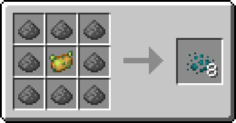

# Химия II


**Ветка** [**древа знаний**](../knowledge-tree.md)**:** 600 ✦ · нужна «[Химия I](chemistry-1.md)»


## Циклоны B, C, D

> Газовые заряды для раздатчика.

Положите циклон в раздатчик: при срабатывании перед ним на **8 секунд** повиснет облако газа радиусом **3 блока**.

| Циклон | Газ          | Эффекты                               | Ингредиент в центре |
| ------ | ------------ | ------------------------------------- | ------------------- |
| **B**  | Удушающий    | Отравление II (5 с), Тошнота (10 с)   | Ядовитый картофель  |
| **C**  | Слепящий     | Слепота (6 с), Замедление II (6 с)    | Чернильный мешок    |
| **D**  | Парализующий | Усталость максимального уровня (10 с) | Искажённый гриб     |

**Рецепт** (за один крафт — 8 шт.): 8 пороха вокруг ингредиента из таблицы.







.png>)



.png>)


