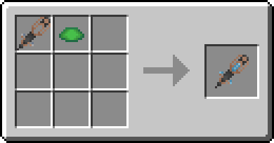
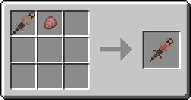

# Инъекции I


**Ветка** [**древа знаний**](../knowledge-tree.md)**:** 500 ✦ · нужна «[Химия I](chemistry-1.md)»


## Как работают стимуляторы

* **ПКМ** — укол себе, **удар** — укол тому, кого бьёте.
* Каждый укол тратит прочность.
* Стимулятор = корпус + катализатор. Вместо корпуса подойдёт любой стимулятор, даже начатый — так один превращается в другой.

## Корпус стимулятора

> Основа для стимуляторов.

**Рецепт:** стрела, 2 железных самородка, медный слиток и медная решётка.

.png>)

## Стимуляторы

| Стимулятор            | Эффект одного укола                                          | Катализатор                                  |
| --------------------- | ------------------------------------------------------------ | -------------------------------------------- |
| Стимулятор роста \[+] | +5 % к росту и немного здоровья (до 140 % роста и 12 сердец) | Щиток черепахи                               |
| Стимулятор роста \[−] | −5 % к росту и немного здоровья (до 60 % роста и 8 сердец)   | Щиток броненосца                             |
| Стимулятор с эффектом | Эффект зелья на 5 секунд, уровень — как у зелья              | Любое зелье: обычное, взрывное или оседающее |

**Рецепт** (в любом порядке): корпус или любой стимулятор + катализатор из таблицы.














