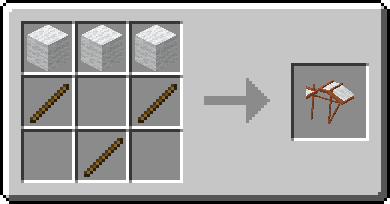

# «Перехват» I


**Ветка** [**древа знаний**](../knowledge-tree.md)**:** 700 ✦ · нужна «[Пиротехника I](pyrotechnics-1.md)»


## Ветрозарядное устройство

> Сбивает летящих на элитрах.

| Свойство         | Значение                                      |
| ---------------- | --------------------------------------------- |
| Как использовать | ПКМ — поток ветра на расстояние до 150 блоков |
| При попадании    | Сбивает с элитр и сильно портит их прочность  |
| Патроны          | 1 стержень вихря за выстрел                   |
| Перезарядка      | 5 секунд                                      |

**Рецепт:** стержень вихря и 2 кварца незера по диагонали.

.png>)

## Самодельный дельтаплан

> Позволяет планировать, пока держишь его в руке.

| Свойство         | Значение                                             |
| ---------------- | ---------------------------------------------------- |
| Как использовать | Держите в руке — вместо падения вы планируете вперёд |
| Сложить          | Шифт в полёте                                        |
| Прочность        | −1 за каждую секунду полёта                          |
| Зачарования      | Только Прочность (до III) и Починка                  |

**Рецепт:** 3 любые шерсти сверху и 3 палки.

