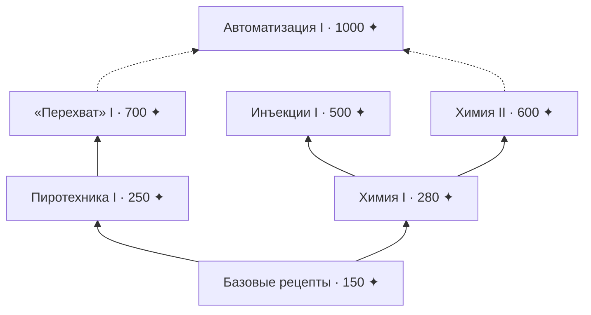

# Древо знаний

> Часть рецептов на HINEX закрыта. Чтобы их открыть, копите **эссенцию ✦** — ветки древа знаний изучатся сами.

## Как получить эссенцию

| За что                           | Сколько |
| -------------------------------- | ------- |
| Достижение                       | +1 ✦    |
| Открытый рецепт в книге рецептов | +1 ✦    |


Эссенция **не тратится**. Рецептов в игре больше тысячи — исследуйте мир и крафтите новое, и ✦ будет капать сама.


## Как открываются ветки

Ветка изучается **автоматически**, когда:

1. у вас набрано нужное количество ✦;
2. изучена хотя бы одна из предыдущих веток.

Пока ветка не изучена, её рецепты не крафтятся (над хотбаром появится подсказка) и скрыты в книге рецептов.

## Схема древа


Для «Автоматизации I» достаточно одной из веток — «Перехват» I **или** Химия II.


## Ветки

| Ветка                                     | ✦    | Нужна ветка               | Открывает                                                            |
| ----------------------------------------- | ---- | ------------------------- | -------------------------------------------------------------------- |
| [Базовые рецепты](crafts/basics.md)       | 150  | —                         | Маска Трагика, смирительная рубашка, невидимая рамка, невидимый свет |
| [Пиротехника I](crafts/pyrotechnics-1.md) | 250  | Базовые рецепты           | Детонатор, граната, молотов                                          |
| [Химия I](crafts/chemistry-1.md)          | 280  | Базовые рецепты           | Феноморфан, Гексалон                                                 |
| [Инъекции I](crafts/injections-1.md)      | 500  | Химия I                   | Корпус и стимуляторы                                                 |
| [«Перехват» I](crafts/intercept-1.md)     | 700  | Пиротехника I             | Ветрозарядное устройство, дельтаплан                                 |
| [Химия II](crafts/chemistry-2.md)         | 600  | Химия I                   | Циклоны B, C, D                                                      |
| [Автоматизация I](crafts/automation-1.md) | 1000 | «Перехват» I или Химия II | Сборщик, прогрузчики чанков I–III, таймер                            |

## Где смотреть прогресс

* **Кнопка с деревом** в меню паузы (Esc) — схема веток, шкала уровней сервера и рецепты выбранной ветки.
* `/древо` — то же самое командой.
* `/эссенция` — ваш счёт и изученные ветки.
* Новая ✦ и изученные ветки показываются уведомлением в правом нижнем углу.

## Уровни сервера

Эссенция всех игроков складывается в общий счёт сервера — каждая ваша ✦ идёт и туда.

| Уровень                      | ✦ сервера | Тема                                             |
| ---------------------------- | --------- | ------------------------------------------------ |
| I. Индустриальный            | 15 000    | Механика, электричество, топливо, логистика      |
| II. Научно-экспериментальный | 30 000    | ИИ, биомодификации, экспериментальные устройства |
| III. Арканический            | 50 000    | Мистические силы, искажение реальности           |
