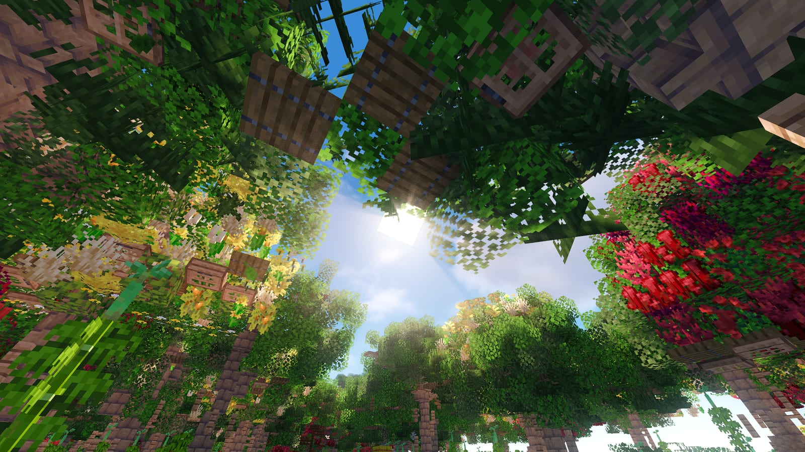

# Начало игры


{% column width="50%" %}
Здесь — всё, что нужно до первого входа: что установить, куда заходить и куда писать, если что-то пошло не так.


{% column width="50%" %}




<table data-view="cards"><thead><tr><th></th><th></th><th></th><th data-hidden data-card-target data-type="content-ref"></th></tr></thead><tbody><tr><td><h3><i class="fa-rocket">:rocket:</i></h3></td><td><strong>Как начать играть</strong></td><td>Лицензия, проходка, мод и первый вход.</td><td><a href="how-to-play.md">how-to-play.md</a></td></tr><tr><td><h3><i class="fa-life-ring">:life-ring:</i></h3></td><td><strong>Поддержка и апелляции</strong></td><td>Куда писать с вопросом или жалобой.</td><td><a href="support.md">support.md</a></td></tr><tr><td><h3><i class="fa-link">:link:</i></h3></td><td><strong>Полезные ссылки</strong></td><td>Telegram, Discord, магазин и мод.</td><td><a href="links.md">links.md</a></td></tr></tbody></table>
